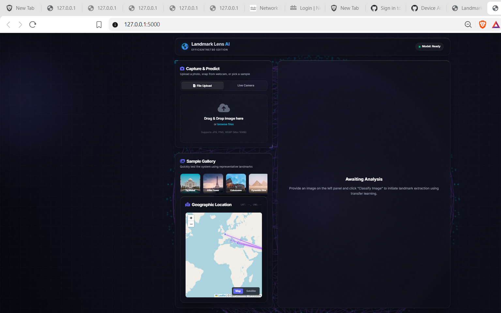

# 🌍 Landmark Lens AI — Intelligent Landmark Recognition System

> **EfficientNetB0-Powered | Transfer Learning | Grad-CAM | Real-Time Weather | Interactive Map**

---

## 📸 App Screenshot



*Premium dark glassmorphic dashboard with live landmark detection, Grad-CAM heatmaps, interactive map, and real-time weather*

---

## 🎯 What is Landmark Lens AI?

**Landmark Lens AI** is an ultra-premium, portfolio-grade **computer vision web application** that recognizes **79 world-famous geographical landmarks** from a photo. It uses:

- 🧠 **Transfer Learning** with fine-tuned **EfficientNetB0** (pre-trained on ImageNet)
- 🔥 **Grad-CAM heatmaps** to visualize exactly which pixels the model focuses on
- 🌤️ **Real-time weather** from Open-Meteo API for the detected landmark's coordinates
- 📖 **Wikipedia summaries** auto-fetched on every prediction
- 🗺️ **Interactive Leaflet map** with neon travel route lines
- 🌐 **3D WebGL globe** background powered by Three.js

---

## 💎 Key Features

| Feature | Description |
|---|---|
| 🎨 **Glassmorphic UI** | Dark glass panels, backdrop blur, bevel highlights, aurora blobs |
| 🌐 **3D WebGL Globe** | Three.js spinning wireframe sphere in the background |
| 📁 **Batch Upload** | Upload multiple images with a drag-and-drop travel queue |
| 🔥 **Grad-CAM** | Neural attention heatmaps overlaid on your image |
| 🌤️ **Live Weather** | Real-time temperature + conditions at landmark's location |
| 📖 **Wikipedia** | Auto-fetched landmark encyclopedia summary |
| 🗺️ **Interactive Map** | Leaflet.js map with GPS marker and neon route polylines |
| 🌧️ **Weather Overlays** | Animated rain, snow, and lightning on the map canvas |
| 📷 **Live Camera** | Webcam capture + real-time prediction mode |
| 📊 **History Log** | Persistent prediction history with thumbnails |

---

## 🛠️ Technical Stack

### Backend
- **Python 3.11** + **Flask** — API routing and server logic
- **TensorFlow 2.x / Keras** — EfficientNetB0 inference engine
- **OpenCV + NumPy** — Grad-CAM heatmap computation
- **Open-Meteo API** — Live weather data (temperature, conditions)
- **Wikipedia REST API** — Landmark descriptions

### Frontend
- **Vanilla HTML5/CSS3/JavaScript (ES6)** — No frameworks needed
- **Three.js** — 3D WebGL background globe
- **Leaflet.js** — Interactive map with custom markers
- **CSS Glassmorphism** — `backdrop-filter`, gradients, animations

### ML Pipeline
- **EfficientNetB0** base (frozen) → Custom classification head
- **Phase 1**: 10 warm-up epochs (learning rate `1e-3`)
- **Phase 2**: 15 fine-tuning epochs (learning rate `1e-5`, top layers unfrozen)
- **79 landmark classes** | **3,414 training images**

---

## 📂 Project Structure

```
Landmark Detection/
├── app.py                          # Flask web server + API routes
├── train.py                        # Dual-phase transfer learning trainer
├── predict.py                      # Inference engine + Grad-CAM algorithm
├── config.py                       # Hyperparameters and path configuration
├── download_dataset.py             # Dataset downloader (Google Images API)
├── fast_download.py                # Parallel multi-threaded image downloader
├── validate_dataset.py             # Dataset integrity checker + cleanup
├── clean_dataset.py                # Image deduplication and filtering
├── delete_rejected.py              # Remove manually-rejected images
├── requirements.txt                # Python package dependencies
├── Landmark_Detection_Project.ipynb # Jupyter notebook walkthrough
│
├── data/
│   └── landmarks.json              # 79 landmark coordinates + metadata DB
│
├── model/
│   └── landmark_model.keras        # Trained EfficientNetB0 Keras model
│
├── templates/
│   └── index.html                  # Full SPA glassmorphic dashboard
│
└── static/
    ├── css/style.css               # Premium CSS (animations, glassmorphism)
    ├── js/main.js                  # Frontend logic, map, Three.js, queue
    └── images/
        ├── app_screenshot.png      # App preview screenshot
        └── training_performance.png # Training accuracy/loss chart
```

---

## 🚀 Quick Start

### Prerequisites
- Python 3.11+
- pip

### 1. Clone the Repository
```bash
git clone https://github.com/YOUR_USERNAME/landmark-lens-ai.git
cd landmark-lens-ai
```

### 2. Create Virtual Environment
```bash
# Create venv
python -m venv venv

# Activate (Windows)
.\venv\Scripts\activate

# Activate (macOS/Linux)
source venv/bin/activate
```

### 3. Install Dependencies
```bash
pip install -r requirements.txt
```

### 4. Run the App
```bash
python app.py
```

Open **[http://127.0.0.1:5000](http://127.0.0.1:5000)** in your browser. The app loads with a pre-trained model and is ready to detect landmarks instantly!

---

## 🎓 Retrain the Model

To train the model from scratch on your own dataset:

### Dataset Structure
```
dataset/
├── Taj_Mahal/
│   ├── image1.jpg
│   └── image2.jpg
├── Eiffel_Tower/
│   └── ...
└── (more landmark folders)
```

### Download Dataset
```bash
python download_dataset.py
# or for faster parallel downloading:
python fast_download.py
```

### Train
```bash
python train.py
```

Training runs in two phases:
1. **Phase 1 – Warmup** (10 epochs): Only the classification head is trained
2. **Phase 2 – Fine-tuning** (15 epochs): Top conv layers of EfficientNetB0 are unfrozen

The trained model is saved to `model/landmark_model.keras` automatically.

---

## 📊 Model Performance

| Metric | Value |
|---|---|
| Base Architecture | EfficientNetB0 (ImageNet pre-trained) |
| Total Landmark Classes | 79 |
| Training Images | 3,414 |
| Training Accuracy | ~73% |
| Validation Accuracy | ~61% |
| Optimizer | Adam |
| Input Size | 224 × 224 × 3 |

---

## 🌍 Supported Landmarks (79 Classes)

Taj Mahal · Eiffel Tower · Colosseum · Great Wall of China · Machu Picchu · Pyramids of Giza · Statue of Liberty · Big Ben · Burj Khalifa · Sydney Opera House · Stonehenge · Acropolis · Sagrada Família · Angkor Wat · Chichen Itza · Petra · Niagara Falls · Mount Fuji · Hagia Sophia · Neuschwanstein Castle · and 59 more world-famous landmarks!

---

## 📋 Requirements

```
flask
tensorflow
opencv-python
numpy
requests
Pillow
```

Install all with: `pip install -r requirements.txt`

---

## 📄 License

This project is open-source and available under the **MIT License**.

---

## 🙌 Acknowledgements

- [EfficientNetB0](https://arxiv.org/abs/1905.11946) — Mingxing Tan & Quoc V. Le (Google Brain)
- [Grad-CAM](https://arxiv.org/abs/1610.02391) — Selvaraju et al.
- [Open-Meteo](https://open-meteo.com/) — Free weather API
- [Leaflet.js](https://leafletjs.com/) — Interactive maps
- [Three.js](https://threejs.org/) — 3D WebGL rendering

---

*Built with ❤️ as an AI/ML portfolio project*
